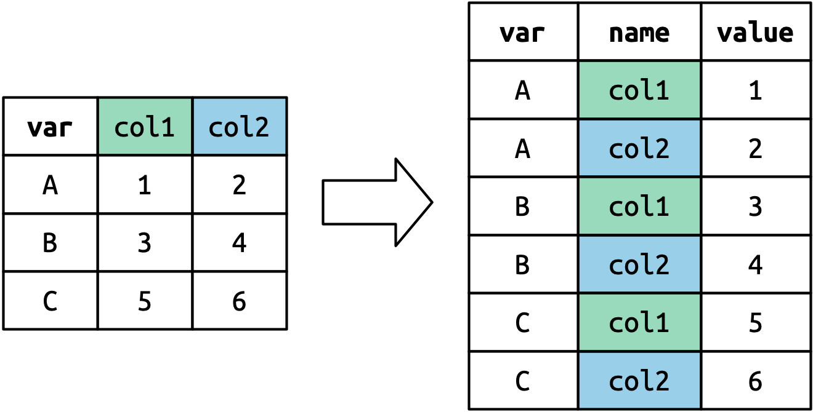
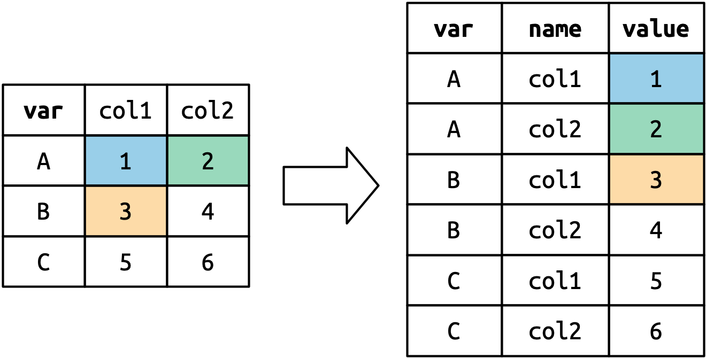

<!-- Add JavaScript code for making the exercise code larger -->

```{=html}
<script language="JavaScript" src="js/exercise-font-size.js"></script>
```
```{r setup, include=FALSE}
library(gradethis)
library(learnr)
library(qsslearnr)
library(tidyverse)
library(stringr)
library(broom)
library(gov50tutor)
library(gov50data)
library(gapminder)

tutorial_options(exercise.checker = gradethis::grade_learnr)
knitr::opts_chunk$set(echo = FALSE)
tut_reptitle <- "QSS Tidyverse Tutorial 5: Output Report"
set.seed(12345)
n <- 10
x <- sample(100)
y <- x + rnorm(100, mean = 0, sd = 0.5)
```

## Conceptual questions


### Loops

```{r concept, echo=FALSE}
quiz(caption = "",
     question("True or False: Loops can simplify our programming code when we want to repeatedly execute code chunks over and over again.",
              answer("True", correct = TRUE),
              answer("False")),
     question("To iterate means to: ",
              answer("perform repeatedly", correct = TRUE),
              answer("perform once"),
              answer("skip over"))
     )
```


Suppose we assign `n <- 10` how many times will the loop `for (i in 1:n)` iterate?


```{r n_times, eccho = FALSE}
question_text("Number of iterations:",
              answer("10", correct = TRUE),
              allow_retry = TRUE)
```


### if statement

```{r ifs, echo=FALSE}
question("In the conditional expression `if (Y) {expression1}`, `expression1` will be executed if `Y` is:",
         answer("`TRUE`", correct = TRUE),
         answer("`FALSE`"))
```


```{r for-if, echo=FALSE}
question("A conditional statement that is nested within a loop is executed _____ the loop.",
         answer("inside", correct = TRUE),
         answer("outside"))
```

## Coding loops

### Loop practice

It is often helpful to create an empty vector to store the computational output from a loop. You can think of this as a bookshelf with spots for the result of each iteration of the loop.

Create a vector called `output` that is filled with `NA` values and has length `n`, we can use the function `rep` here. We've already loaded `n` into your environment with a value of 10.

```{r holder, exercise = TRUE}
output <-  
```

```{r holder-check}
grade_result(
  pass_if(~ identical(output, rep(NA, n)), "Good job!")
)
```

### Printing to the screen

In R, it's often very useful to print something to the screen and this is especially helpful when using loops. This can help us diagnose problems in the loop.

Use the `print()` and `str_c` functions to put together a phrase and the object `n`. The final output should read `The object n has value 10`.

```{r cat, exercise = TRUE}

```

```{r cat-solution}
print(str_c("The object n has value ", n))
```

```{r cat-check}
grade_code()
```

### unique

We've added the following vector `fruit` to the code. Use the `unique` function to determine the different types of fruit in the vector. This function will take a vector and return a new vector with the unique values of the original vector.


```{r unique, exercise = TRUE}
fruit <- c("apple", "orange", "banana", "orange", "apple", "apple")

```

```{r unique-solution}
fruit <- c("apple", "orange", "banana", "orange", "apple", "apple")

unique(fruit)
```

```{r unique-check}
grade_code()
```

### FizzBuzz

Here is a variant of the classic "FizzBuzz" coding question. Write a for loop that executes the code

     print(str_c("The following number i is divisible by 3, ", i))

for numbers from 1 to 50 (inclusive) only for the numbers divisible by 3. Include brackets for the conditional. Remember that you can find if a number `A` is divisible by another number `B` by using `A %% B == 0`.

`"\n"` at the end of `print(str_c())` adds a line break to the output.

```{r fizzbuzz, exercise = TRUE}

```


```{r fizzbuzz-solution}
for(i in 1:50){
  if (i %% 3 == 0) {
    print(str_c("The following number i is divisible by 3, ", i))
  }
}
```

```{r fizzbuzz-check}
grade_code()
```

### Adding a condition

Continuing from the previous FizzBuzz code you wrote, use an `else if` statement to execute the following code if the number is divisible by 5 (but not by 3):

    print(str_c("The following number i is divisible by 5, ", i))

```{r fizzbuzz2, exercise = TRUE}
for(i in 1:50){
  if (i %% 3 == 0) {
    print(str_c("The following number i is divisible by 3, ", i))
  }
}
```

```{r fizzbuzz2-solution}
for(i in 1:50){
  if (i %% 3 == 0) {
    print(str_c("The following number i is divisible by 3, ", i))
  } else if (i %% 5 == 0) {
    print(str_c("The following number i is divisible by 5, ", i))
  }
}
```

```{r fizzbuzz2-check}
grade_code()
```


## Linear Regression

### Conceptual questions

```{r lm-multi, echo = FALSE}
quiz(
  caption = "",
  question(
    "We use the regression line to predict the value of the outcome variable y hat, otherwise known as:",
    answer("predicted value"),
    answer("fitted value"),
    answer("both of these", correct = TRUE)),
  question(
    "The differences between the observed outcome and its predicted value is called a:",
    answer("residual"),
    answer("prediction error"),
    answer("either of these", correct = TRUE)),
  question(
    "An R^2 close to 1 suggests the model fits:",
    answer("well", correct = TRUE),
    answer("not well")),
  question(
    "With a single binary independent variable, what is the interpretation of the slope coefficient in a linear regression model?",
    answer("Average outcome in the `X = 1` group"),
    answer("Average outcome in the `X = 0` group"),
    answer("Differences in means between the `X=1` and `X=0` groups", correct = TRUE))
)
```

### Interpreting intercepts

In the following box, type answer to the following question: The intercept in the model $Y_i = \alpha + \beta X_i + \epsilon_i$ represents the average value of $Y_i$ when $X_i$ is equal to what?

```{r intercept, echo = FALSE}
question_text(
  "The intercept is the average of Y when X is equal to:",
  answer("0", correct = TRUE)
)
```


### Running regressions in R

We have included two vectors `x` and `y`. Regress `y` on `x` and assign it to an object called `fit` and print that object to see what the output looks like.

```{r lm, exercise = TRUE}

```

```{r lm-solution}
fit <- lm(y ~ x)
fit
```

```{r lm-check}
grade_result(
  pass_if(~ identical(coef(.result), coef(lm(y~x))))
)
```

### Accessing output from lm

Now, use the `coef()` function to access coefficients in the `fit` object.

```{r coef, exercise = TRUE}
fit <- lm(y ~ x)

```

```{r coef-check}
grade_result(
  pass_if(~ identical(.result, coef(fit)), "Good job!")
)
```


Now you can also access the fitted values using either the `fitted()` or `predict()` function. Print the fitted values here:

```{r fitted, exercise = TRUE}
fit <- lm(y ~ x)

```

```{r fitted-check}
grade_result(
  pass_if(~ identical(.result, fitted(fit)) | identical(.result, predict(fit)),
          "Good job!")
)
```

### Model fit

Use the `summary()` function to access the value of $R^2$, which is named `r.squared` inside
the `summary()` output.
Remember that you have to access a particular name from that summary using the `$`.

```{r rsq, exercise = TRUE}
fit <- lm(y ~ x)

```


```{r rsq-check}
grade_result(
  pass_if(~ identical(.result, summary(fit)$r.squared), "Good job!")
)
```


### Converting the output into tidy data

When working on the output from `lm()` in tidyverse, you sometimes need to convert the output into tidy data. The `broom` package from `tidymodels` provides some useful functions for summarizing the output in the form of tidy data. 

Use `glance()` function to create one-row dataframe summary of the `fit` object.

```{r glance-setup}
fit <- lm(y ~ x)
```

```{r glance, exercise = TRUE}

```

```{r glance-check}
grade_result(
  pass_if(~ identical(.result, glance(fit)), "Marvelous!")
)
```

Next, use `tidy()` function to create a data frame summary in which each row shows a coefficient.

```{r tidy-setup}
fit <- lm(y ~ x)
```

```{r tidy, exercise = TRUE}

```

```{r tidy-check}
grade_result(
  pass_if(~ identical(.result, tidy(fit)), "You nailed it!")
)
```

Finally, use `augment()` function to add fitted values, residuals, and other observation level stats to the original data. Here, be sure to add `head()` to your answer, otherwise, the entire data set will show up.

```{r augment-setup}
fit <- lm(y ~ x)
```

```{r augment, exercise = TRUE}
head( )
```

```{r augment-check}
grade_result(
  pass_if(~ identical(.result, head(augment(fit))), "Keep up the good work!")
)
```

## Tidying data from wide to long

We sometimes get data in formats that are not ideal. The `mortality` data from the `gov50data` package is an example of this. It is a data with countries on the rows with measurement of child mortality by year in the columns:

```{r}
mortality
```

Compared to the `gapminder` data, this isn't ideal since we have information in the column names (year of the measurement) that we could better use if it were in the rows. So we would like to turn this into a data frame with rows that are country years. We can do this with the `pivot_longer` function. 

To see how this works, let's use an example from [R for Data Science](https://r4ds.hadley.nz/data-tidy.html#how-does-pivoting-work) with this simple tibble:

```{r}
df <- tibble(
  var = c("A", "B", "C"),
  col1 = c(1, 3, 5),
  col2 = c(2, 4, 6)
)
df
```

Now we can pivot this to put the columns into rows with this code:
```{r}
df %>%
  pivot_longer(
    cols = col1:col2,
    names_to = "names",
    values_to = "values"
  )
```

This function duplicates any non-pivoting columns as many times as there are columns in `cols`. 

{width="50%"}

It then creates a new column with a name based on `names_to` that puts the names of each column in `cols`. 

{width="50%"}

Finally, it creates a new column with a name based on `values_to` that will contain each 

{width="50%"}


### Pivoting with mortality data

Let's try this with the `mortality` data. Complete the following code to pivot the columns `` `1972` `` through `` `2020` `` where the column names should go to a variable called `"year"` and the values in the columns should go to a variable called `"child_mortality"`. 


```{r pivot, exercise = TRUE}
mortality %>%
  pivot_longer(
    cols = ____:____,
    names_to = ___,
    values_to = ____
  )
```

```{r pivot-solution}
mortality %>%
  pivot_longer(
    cols = `1972`:`2020`,
    names_to = "year",
    values_to = "child_mortality"
  )
```

```{r pivot-check}
grade_this_code()
```


### Cleaning up the pivot

This pivot looks pretty good, but we have leftover junk that we can get rid of. Add the argument `values_drop_na = TRUE` to the call to `pivot_longer` and then remove the `indicator` variable using the `select()` function. The `values_drop_na = TRUE` argument will remove any missing values from the new values column. 


```{r pivot2, exercise = TRUE}
mortality %>%
  pivot_longer(
    cols = `1972`:`2020`,
    names_to = "year",
    values_to = "child_mortality"
  )
```

```{r pivot2-solution}
mortality %>%
  pivot_longer(
    cols = `1972`:`2020`,
    names_to = "year",
    values_to = "child_mortality",
    values_drop_na = TRUE
  ) %>%
  select(-indicator)
```

```{r pivot2-check}
grade_this_code()
```

## Joining two data frames

In many situations we might have data for the same units in two different data frames. This is the case with the `gapminder` data and the `mortality` data that we've been working with. To combine the columns of the data frame, we can use the family of `join` commands. We these commands will find common identification variables in two data frames join the columns of both data sets aligned on these "joining variables." 

### left_join


There are two different ways that we can join that differ in how they handle rows that are present in one data set but not the other. The first is called `left_join()` and its syntax is:

```{r eval=FALSE}
df_1 %>%
  left_join(df_2)
```

It will preserve all rows that are in the data set in `df_1` even if they are not present in `df_2`. The variables from the second data set will be missing for any rows that are in the first data but not in the second. 

Let's try to this with the gapminder and mortality data. We've set it up so that the mortality data has already been pivoted. Pipe the `mortality_tidy` to `left_join` and pass it the `gapminder` data to see what merge looks like. Note that the `gapminder` data is only measured every five years. 


```{r left-join, exercise = TRUE}
mortality_tidy <- mortality %>%
  pivot_longer(
    cols = `1972`:`2020`,
    names_to = "year",
    values_to = "child_mortality",
    values_drop_na = TRUE
  ) %>%
  select(-indicator) %>%
  mutate(year = as.integer(year))

mortality_tidy %>%
  _____(______)
```

```{r left-join-solution}
mortality_tidy <- mortality %>%
  pivot_longer(
    cols = `1972`:`2020`,
    names_to = "year",
    values_to = "child_mortality",
    values_drop_na = TRUE
  ) %>%
  select(-indicator) %>%
  mutate(year = as.integer(year))

mortality_tidy %>%
  left_join(gapminder)
```

```{r left-join-check}
grade_this_code()
```

### inner_join

The second way we might join is called `inner_join()` and it will only return rows that are present in both data sets. Let's try to merge the tidied mortality data with the gapminder data doing an `inner_join()`. What do you notice that's different about the rows that are returned?


```{r inner-join, exercise = TRUE}
mortality_tidy <- mortality %>%
  pivot_longer(
    cols = `1972`:`2020`,
    names_to = "year",
    values_to = "child_mortality",
    values_drop_na = TRUE
  ) %>%
  select(-indicator) %>%
  mutate(year = as.integer(year))

mortality_tidy %>%
  _____(______)
```

```{r inner-join-solution}
mortality_tidy <- mortality %>%
  pivot_longer(
    cols = `1972`:`2020`,
    names_to = "year",
    values_to = "child_mortality",
    values_drop_na = TRUE
  ) %>%
  select(-indicator) %>%
  mutate(year = as.integer(year))

mortality_tidy %>%
  inner_join(gapminder)
```

```{r inner-join-check}
grade_this_code()
```


## Submit

```{r context="setup"}
submission_ui
```

```{r context="server"}
submission_server()
```
